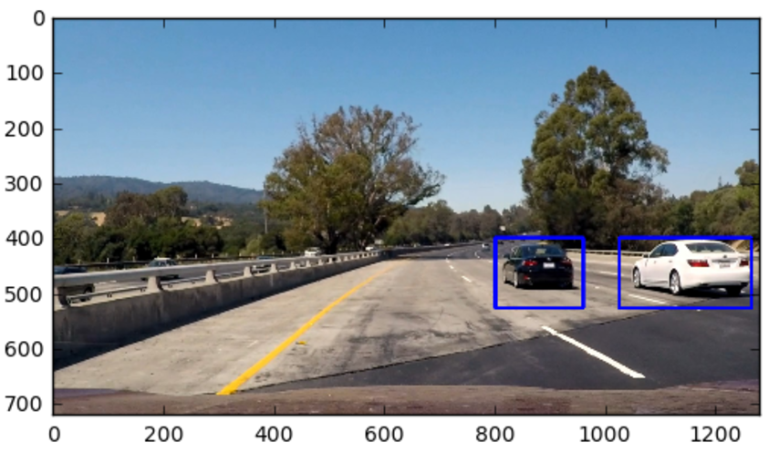

# Vehicle Detection Using Classical Computer Vision

A computer vision pipeline that identifies and tracks vehicles in dashcam footage using traditional machine learning techniques. This project blends feature engineering, sliding window detection, and heatmap-based filtering to build a functional car detector—no deep learning involved!

 <!-- Optional: add a visual banner -->

---

## Project Summary

This project demonstrates a vehicle detection pipeline using handcrafted image features (HOG, color histograms, spatial binning) and a Linear Support Vector Machine (SVM) classifier. It's designed to process road video footage and annotate vehicles in real time.

This is a modern implementation of classic vision techniques, built to better understand the foundations of autonomous vehicle perception systems.

---

## 🔍 Key Features

- ✅ HOG (Histogram of Oriented Gradients) for capturing object structure
- ✅ Color-based features to enrich classification
- ✅ Linear SVM classifier trained on labeled datasets
- ✅ Sliding window search across multiple scales
- ✅ Heatmap + thresholding to consolidate detections
- ✅ Video processing for frame-by-frame tracking

---


## 🛠️ How to Run

1. Clone the repository:
   ```bash
   git clone https://github.com/hareeshrp/vehicle-vision.git
   cd vehicle-detection-classical-cv
   ```

2. Launch Jupyter Notebook and open `project.ipynb`:
   ```bash
   jupyter notebook
   ```

3. Run all cells sequentially to:
   - Extract features
   - Train the vehicle classifier
   - Process the video for car detection

---


## 🎥 Sample Output


---

## ✨ Improvements & Next Steps

- Add hard negative mining to improve classifier robustness
- Integrate temporal smoothing across video frames
- Benchmark with YOLO or Haar Cascades for performance comparison
- Explore false positive suppression using image pyramids


## 🧭 Acknowledgments

This project is inspired by a concept from the Udacity Self-Driving Car Nanodegree, adapted and restructured with custom enhancements, new documentation, and modular code organization.

---

## 🔗 Connect With Me

If you're working on similar projects or exploring classical ML in computer vision, I'd love to connect!

[LinkedIn](https://www.linkedin.com/in/YOUR_LINKEDIN)
